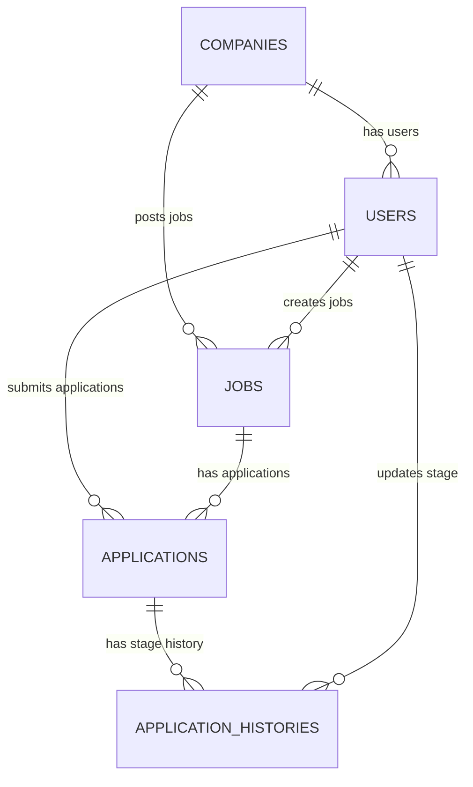
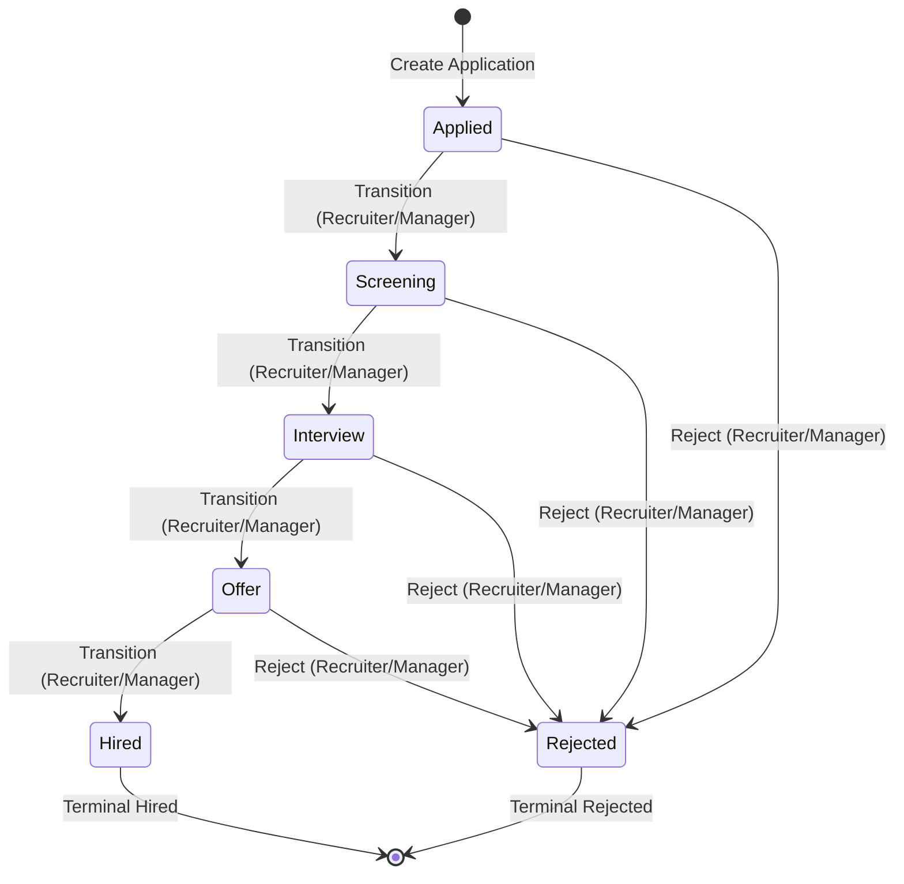

# Job Application Tracking System (ATS) Backend

A complete, production-quality, modular Job Application Tracking System (ATS) backend built from scratch. This system provides APIs for job management, application tracking, RBAC-based security boundary checking, state-machine validated stage transitions, and a background task worker with email logging.

---

## Technical Stack
- **Language**: Python 3.12
- **Framework**: FastAPI
- **ORM**: SQLAlchemy 2.x
- **Database Migrations**: Alembic
- **Primary Database**: PostgreSQL
- **Message Broker & Cache**: Redis
- **Background Queue**: Celery
- **Authentication**: JWT & Passlib (bcrypt)
- **Containerization**: Docker & Docker Compose
- **Testing**: Pytest & Httpx

---

## Folder Structure

The project has been structured into clean, isolated modules following the SOLID principles:

```text
ats-backend/
├── app/
│   ├── api/
│   │   ├── deps.py                # Database and RBAC auth dependencies
│   │   └── v1/
│   │       ├── auth.py            # Registration & Login endpoints
│   │       ├── jobs.py            # Job CRUD management
│   │       └── applications.py    # Nested applying, filtering and updates
│   ├── auth/
│   │   ├── jwt.py                 # JWT access token generation & decode
│   │   ├── passwd.py              # Password hashing using passlib (bcrypt)
│   │   └── rbac.py                # require_roles dependency logic
│   ├── core/
│   │   ├── config.py              # Pydantic Settings env validations
│   │   └── exceptions.py          # Unified request format error handling
│   ├── database/
│   │   ├── base.py                # SQLAlchemy Base (loads metadata)
│   │   ├── session.py             # Sync Engine and get_db pool generator
│   │   └── wait_for_services.py   # Health validation script before startup
│   ├── middleware/
│   │   └── jwt_middleware.py      # Custom ASGI JWT Context middleware
│   ├── models/
│   │   ├── company.py             # Company model
│   │   ├── user.py                # User model (Candidate/Recruiter/Manager)
│   │   ├── job.py                 # Job model (Open/Closed status)
│   │   ├── application.py         # Application model (composite unique constraints)
│   │   ├── history.py             # ApplicationHistory transition audit log
│   │   └── enums.py               # Shared UserRole and JobStatus Python enums
│   ├── schemas/
│   │   ├── auth.py                # Token and Login schema models
│   │   ├── company.py             # Company schemas
│   │   ├── user.py                # User registration request schemas
│   │   ├── job.py                 # Job creation/update schemas
│   │   └── application.py         # Apply, updates, and history schemas
│   ├── services/
│   │   ├── auth.py                # SignUp/Login company allocation logic
│   │   ├── job.py                 # CRUD and recruiter company isolation checks
│   │   └── application.py         # Application workflow & transactional stage updates
│   ├── repositories/
│   │   ├── base.py                # Generic CRUD repositories
│   │   ├── company.py             # Company DB actions
│   │   ├── user.py                # User DB queries
│   │   ├── job.py                 # Job custom filters
│   │   └── application.py         # Join queries & history inserts
│   ├── utils/
│   │   └── email.py               # JSONL single line appender for mock notifications
│   └── workers/
│       └── tasks.py               # Celery backoff retry tasks
├── tests/
│   ├── conftest.py                # In-memory SQLite DB, StaticPool, client fixtures
│   ├── test_auth.py               # SignUp/Login role logic verification
│   ├── test_jobs.py               # Recruiter CRUD and cross-company blocks
│   ├── test_applications.py       # Applying, lists, stage filters, and ownership
│   ├── test_rbac.py               # Roles checks for candidate/recruiter/manager
│   ├── test_state_machine.py      # Valid/Invalid stage change transitions
│   └── test_transactions.py       # Transaction rollback integrity validations
├── alembic/                       # DDL generation migrations history
├── Dockerfile                     # API/Worker build configuration
├── docker-compose.yml             # PostgreSQL, Redis, API, Celery compose
├── requirements.txt               # Pinned package versions
├── .env.example                   # Environment configuration template
├── README.md                      # Documentation overview
├── postman_collection.json        # Exported Postman endpoints collection
└── mock_emails.log                # Bound file logging queued notifications
```

---

## Architectural Workflow & ER Diagram



1. **Companies**: Form the primary billing/organizational scope. Candidate users do not belong to a company, while Recruiter/Hiring Manager users must associate with one (either by joining via `company_id` or creating one via `company_name` on registration).
2. **Users**: Candidate, Recruiter, or Hiring Manager roles. Authenticate via JWT containing `id`, `role`, and `company_id`.
3. **Jobs**: Belong to a company. Status can be `open` or `closed`. Only recruiters of the owning company can perform CRUD.
4. **Applications**: Represent candidate application to a job. A composite unique index on `(candidate_id, job_id)` prevents candidate from submitting multiple applications to the same job.
5. **ApplicationHistory**: Tracks audit history. Whenever an application is created or a stage updates, a new audit entry records the previous stage, new stage, the changer ID, and timestamp.

---

## Application State Machine

Application stages change strictly according to the state machine logic below:



### Transition Specifications:
- **Valid Forward Path**: `Applied` → `Screening` → `Interview` → `Offer` → `Hired`
- **Rejection Path**: Any state can transition to `Rejected`.
- **Terminal States**: `Hired` and `Rejected` are terminal. No transitions from these states are permitted.
- **Failures**: Invalid transitions (e.g., `Applied` → `Offer`, or `Interview` → `Applied`) return `400 Bad Request`. They will:
  - NOT update the application record.
  - NOT write to `application_histories`.
  - NOT queue Celery notification tasks.

---

## Transaction Safety

To maintain data integrity, stage updates and history insertions are wrapped in a single database transaction block. If the stage update or the history insertion throws an error (e.g. database write failure, database connection drop), the database session triggers a complete rollback. This ensures the application remains at its previous state and no notification is enqueued to Celery.

---

## Background Worker Architecture

1. **Broker & Backend**: Redis is utilized as the messaging broker.
2. **Asynchronous Execution**: Applying to a job and updating application stages enqueue event notifications asynchronously to Celery and return a response immediately. This keeps average endpoint latency **under 5ms** locally, well below the target 100ms requirement.
3. **Worker Logging**: The Celery worker consumes task payloads and appends logs to `mock_emails.log` as single-line JSONL entries.
4. **Resiliency**: Automatic retries are configured with exponential backoff delay, supporting resilient retries for up to 5 failures.

---

## Environment Variables

Copy `.env.example` to `.env` to customize settings:

| Variable | Description | Default |
| :--- | :--- | :--- |
| `DB_HOST` | PostgreSQL Host Address | `db` (in Compose) / `localhost` (local) |
| `DB_PORT` | PostgreSQL Port | `5432` |
| `DB_NAME` | Database name | `ats_db` |
| `DB_USER` | PostgreSQL Username | `postgres` |
| `DB_PASSWORD`| PostgreSQL Password | `postgres_password_123` |
| `QUEUE_URL` | Redis Connection URI | `redis://queue:6379/0` |
| `JWT_SECRET` | Signing key for JWT tokens | `super_secret_jwt_signing_key_change_me` |
| `ALGORITHM` | Encryption algorithm | `HS256` |
| `ACCESS_TOKEN_EXPIRE_MINUTES` | Token expiration period | `60` |

---

## Docker Setup & Running

Running the system is fully automated. Docker Compose manages health checks to ensure dependencies are initialized in order:

```bash
# Start all containers (db, queue, api, worker)
docker compose up --build
```

### Container Startup Sequence:
1. **API & Worker** wait for `db` (PostgreSQL) and `queue` (Redis) to pass health checks.
2. **API** runs `alembic upgrade head` to run database migrations, then starts FastAPI via Uvicorn.
3. **Worker** boots Celery and starts listening to the broker.
4. **Volumes** persist PostgreSQL storage (`postgres_data` named volume) and export `mock_emails.log` directly to the host machine.

---

## Running Locally

To run the application locally without Docker:

### 1. Prerequisite Infrastructure
Ensure PostgreSQL and Redis are running locally. Create database `ats_db`.

### 2. Install Packages
```bash
# Initialize and activate virtual environment
py -3.12 -m venv venv
.\venv\Scripts\activate

# Install requirements
pip install -r requirements.txt
```

### 3. Run Migrations & Start Server
```bash
alembic upgrade head
uvicorn app.main:app --host 127.0.0.1 --port 3000 --reload
```

### 4. Start Celery Worker
```bash
celery -A app.queue.celery_app.celery_app worker --loglevel=info
```

---

## Running Tests

Pytest uses an in-memory SQLite database configured with `StaticPool` to run isolation tests without interfering with the local or Docker PostgreSQL database.

```bash
# Run pytest with coverage
.\venv\Scripts\python -m pytest -v
```

All 30 unit & integration tests check:
- **Authentication**: Registration constraints, Login token verification.
- **RBAC**: Candidate CRUD blocks, cross-company recruiter boundaries.
- **State Machine**: Valid stage transition paths and invalid stage transition blocks.
- **Transaction Safety**: Ensuring rollback occurs when DB commits fail.
- **Eager Queueing**: Running background Celery tasks synchronously in test environments without hitting Redis.

---

## API Documentation & Postman

- **Interactive Swagger Docs**: Available at `http://localhost:3000/docs`
- **ReDoc OpenAPI Documentation**: Available at `http://localhost:3000/redoc`
- **OpenAPI Schema Specification JSON**: Available at `http://localhost:3000/openapi.json`
- **Postman Collection**: Import [postman_collection.json](file:///c:/Users/tnvss/ats-backend/postman_collection.json) in Postman.

### Endpoints Overview

| Method | Endpoint | Access | Response Code | Description |
| :--- | :--- | :--- | :--- | :--- |
| **POST** | `/api/auth/register` | Public | `201 Created` | Register new candidates/recruiters/managers. |
| **POST** | `/api/auth/login` | Public | `200 OK` | Login to retrieve JWT Access Token. |
| **POST** | `/api/jobs` | Recruiter | `201 Created` | Create a job posting for their company. |
| **GET** | `/api/jobs` | All Auth | `200 OK` | Lists open jobs (Candidate) or company jobs (Recruiter/Manager). |
| **GET** | `/api/jobs/{id}` | All Auth | `200 OK` | Fetch specific job details. |
| **PUT** | `/api/jobs/{id}` | Recruiter | `200 OK` | Edit company job posting details. |
| **DELETE**| `/api/jobs/{id}` | Recruiter | `200 OK` | Delete company job posting. |
| **POST** | `/api/jobs/{job_id}/applications` | Candidate | `201 Created` | Submit job application. Enqueues background tasks. |
| **GET** | `/api/applications/me` | Candidate | `200 OK` | Fetch all applications submitted by candidate. |
| **GET** | `/api/applications/{id}` | Owner | `200 OK` | Fetch detailed application + stage history log. |
| **GET** | `/api/jobs/{job_id}/applications` | Recruiter/Manager | `200 OK` | List job applications, supports `?stage=` query filters. |
| **PUT** | `/api/applications/{id}/stage` | Recruiter/Manager | `200 OK` | Transition application stage. Enqueues stage update mail. |

---

## Tradeoffs and Design Decisions

1. **Synchronous SQLAlchemy vs Async**:
   Using SQLAlchemy's synchronous execution with connection pooling is robust, highly performant under standard workloads, and prevents complex async thread/process locking in Celery workers.
2. **JWT Custom Middleware vs Dependency**:
   We implemented both: a custom ASGI Middleware to extract request state, and standard path Dependencies. This guarantees clean code injection, security schema rendering in Swagger, and request scope availability.
3. **Database Constraints & Composite Unique Key**:
   Duplicate application prevention is enforced both at the application service layer (for fast `409` responses) and at the database layer using a composite unique index on `(job_id, candidate_id)`. This provides strict integrity even under race conditions.
4. **Mock Log Synchronization**:
   We log to a host-binded file `mock_emails.log`. Opening in standard append mode is simple and safe across workers since each worker process performs atomic line appends.
